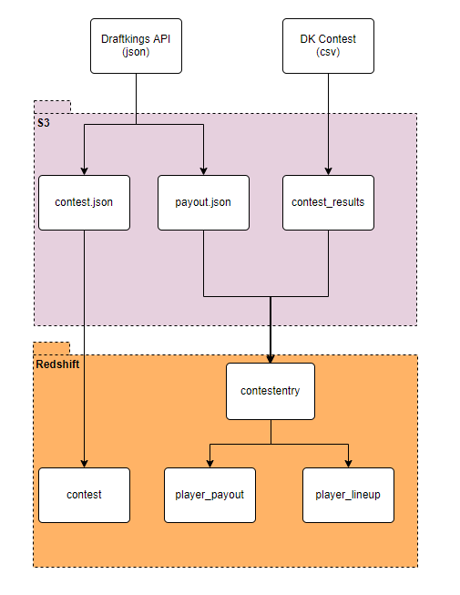

## Overview

Daily Fantasy Sports (DFS) is a an increasingly popular way of playing fantasy sports.  As DFS became popular, the competition became tougher.  However, biggest vendors (such as Draftkings) are offering competition of non-tradition sports.

One of the best ways to improve as a player is to analyze other professional lineups.  This project creates a pipeline that analyzes the 2021 spring split season in order to analyze the performance and lineups of top users.

## Data Pipeline

The data pipeline is for this project is as follows:
* Download JSON files from the unofficial draftkings API into S3 directory
* Download pasts contests (CSV) from an automated script into S3 directory
* Clean and load data into redshift database 
* Insert relevant tables from staging to production

This process can be visualized below

## Technology

### Redshift

Redshift is being used to store this data because it is persistent, scalable and fast.
Since redshift is located on the cloud, it is always available.
As more data is loaded into the database, redshift can be scaled by adding addition storage space.
Finally, the MPP capability of redshift allow queries to run very quickly, which saves time to analyze the data output.

## Data Sources

### Draftkings API

This dataset will include all the information about a contest. It is an unofficial API, and code can be found [here](https://github.com/jaebradley/draftkings_client)

#### Drafkings Contest Results

This data comes from the actual draftkings contest.  Downloading this data require a draftkings account login, and the contest results are no longer after two weeks after the completion.  I have compiled a list of downloaded files [here](https://s3.console.aws.amazon.com/s3/buckets/luz24?region=us-east-1&prefix=dailyfantasy_lol/contest_results/&showversions=false)

## Data Model and Data Dictionary

The final data model is a relational model.  It is made up of 3 tables: contest, player_lineup, and player_payout.
The contest table is the dimension table.  The player_lineup and player_payout tables are fact tables

The end user can use player_payout and contest table to find the top players by prize
The end user can use player_lineup and contest table to study lineups related to specific contests

#### Contest

| Column | Type | Description |
| ------ | ---- | ----------- |
| `contestid` | `int` | Primary Key.  The identifier of a contest |
| `draftgroupid` | `int` | Id that is linked to a draftgroup.  Draftgroups are not part of this dataset |
| `name` | `varchar(255)` | The name of the draftkings contest |
| `entryfee` | `numeric(18,18)` | The entry fee required to enter this contest (USD) |
| `entries` | `int` | The total number of entries in this contest |
| `maximumentries` | `int` | The total number of entries allowed in this contest |
| `maximumentriesperuser` | `int` | The maximum number of entries allowed for a single user in this contest |
| `totalpayouts` | `numeric(18,18)` | Total amount of prize of pool available in this contest |
| `conteststatedetail` | `numeric(18,18)` | State of the contest.  Can be completed, active, or upcoming. |
| `conteststarttime` | `varchar(255)` | The start datetime of the contest |

#### player_lineup

| Column | Type | Description |
| ------ | ---- | ----------- |
| `contestid` | `int` | The identifier of a contest.  This is a foreign key to the contest table |
| `entryid` | `int` | Primary Key.  Lineup id of the contest. |
| `player` | `varchar(255)` | The name of the player or user that entered the contest |
| `cpt` | `varchar(255)` | Lineup - Captain selection.  Players from this position are accrued 1.5x fantasy points |
| `topl` | `varchar(255)` | Lineup - top lane selection |
| `jng` | `varchar(255)` | Lineup - jungle selection |
| `mid` | `varchar(255)` | Lineup - mid selection |
| `adc` | `varchar(255)` | Lineup - adc selection |
| `sup` | `varchar(255)` | Lineup - support selection |

#### player_payout

| Column | Type | Description |
| ------ | ---- | ----------- |
| `contestid` | `int` | The identifier of a contest.  This is a foreign key to the contest table |
| `entryid` | `int` | Primary Key.  Lineup id of the contest. |
| `player` | `varchar(255)` | The name of the player or user that entered the contest |
| `rank` | `varchar(255)` | The position that this contest finished in |
| `entryfee` | `varchar(255)` | Entry fee paid for this contest |
| `prize` | `varchar(255)` | The reward for this contest entry |

## Other Scenarios

* The data was increased by 100x.
    * Use spark to run the data cleaning process.  Spark enables the data flow process to be run on multiple machines in a distributed way (eg. on AWS EMR)
* The pipelines would be run on a daily basis by 7 am every day.
    * The data pipeline can be automated by being deployed on Apache Airflow.  A dag can then be created to run at 7am everyday.
* The database needed to be accessed by 100+ people.
    * The database is currently deployed on Amazon Redshift cluster, and can be accessed by large number of users